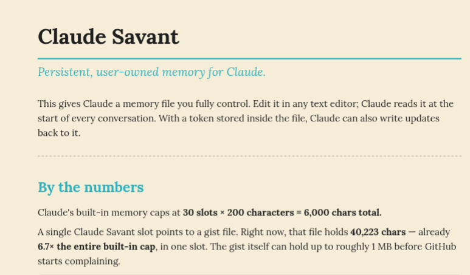

# Claude Savant

Persistent, user-owned memory for Claude.

This gives Claude a memory file you fully control. Edit it in any text editor; Claude reads it at the start of every conversation. With a token stored inside the file, Claude can also write updates back to it.

## By the numbers

Claude's built-in memory caps at **30 slots × 200 characters = 6,000 chars total**.

A single Claude Savant slot points to a gist file. Right now, that file holds **40,223 chars** — already **6.7× the entire built-in cap**, in one slot. The gist itself can hold up to roughly 1 MB before GitHub starts complaining.

---

Full walkthrough: [claude-savant.md](claude-savant.md) · [claude-savant.pdf](claude-savant.pdf)
